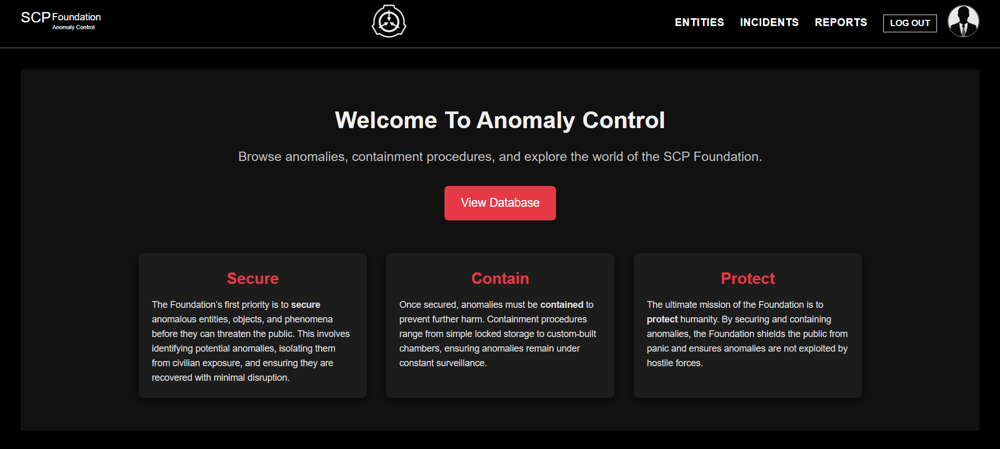
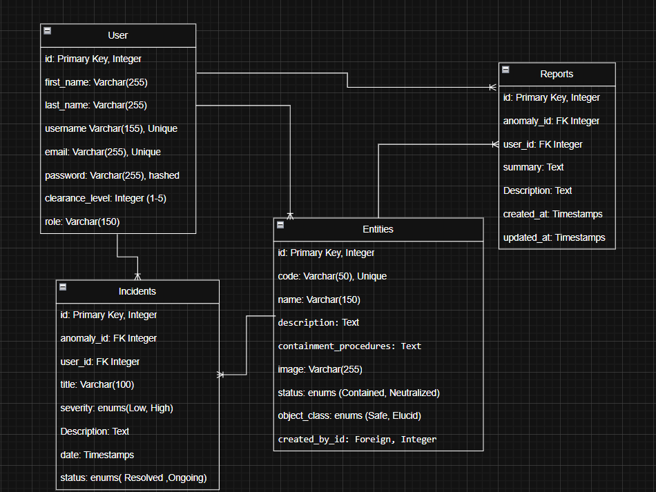

# 🕵️ Anomaly Control

## 📖 About Page 

**Secure. Contain. Protect.**  
A fullstack web application for managing and exploring anomalies inspired by the SCP Foundation universe.  
Users can browse classified files, view containment procedures, and access restricted data based on their clearance level and assigned role.  

---

## 📖 About

**Anomaly Control** is a fictional database system designed to simulate how a secret organization might track and manage dangerous or mysterious anomalies.  

The app uses **Django** to provide:  
- A secure anomaly archive  
- Clearance- and role-based access restrictions  
- Reports and incident tracking  
- An immersive experience for fans of mysterious phenomena  

Core focus:  
- **Secure** anomalies in a structured system  
- **Contain** them with detailed procedures  
- **Protect** humanity by limiting access through clearance levels  

---

## 📑 Planning Materials

- 📋 [Trello Board](https://trello.com/b/AD2NOa4V/anomaly-control) – Task management and project planning  
- 🗂️ [Draw.io Diagrams (ERD & Wireframes)](https://app.diagrams.net/#G1T4fY1rV5qrs44AFR3wSxxRObTC970gm1#%7B%22pageId%22%3A%22jnQW0kWYOzWuQQ7AjmSw%22%7D) – Entity-Relationship Diagram & UI Wireframes  

---

## 🚀 Features (MVP)

- 🔑 User authentication & clearance levels (1–5)  
- 🧑‍🔬 Role-based access (Researcher, Guard, Class-D, Site Director, O5, etc.)  
- 📂 Entity (Anomaly) entries with:
  - Code (e.g., AC-173)  
  - Name  
  - Object class (Safe, Euclid, Keter, Thaumiel, Archon)  
  - Containment procedures  
  - Description  
  - Optional media (images)  
  - Created by user reference  
- 📝 Reports linked to entities  
- ⚠️ Incidents with severity, status, and reporter tracking  
- 🛠️ Admin dashboard for managing anomalies, reports, and incidents  
- 🌐 REST API endpoints for anomaly data  

---

## 🌟 Future Features

- 📜 Experiment logs & ethics reviews  
- 👥 Personnel database with transfer history  
- 🏢 Facility/Site database with assigned anomalies  
- 🕵️ Groups of Interest (GoIs) and anomaly conflicts  
- 🎲 “File of the Day” anomaly spotlight  
- 🔒 Classified sections that unlock with higher clearance  

---

## 🗂️ Data Models (MVP)

### User
Extends Django’s `AbstractUser`  
- `id` (int, PK)  
- `username` (string)  
- `email` (string)  
- `password` (hashed)  
- `clearance_level` (int: 1–5)  
- `role` (choice: Class-D, Researcher, Security Guard, O5, Site Director, Medical, Technician)  
- `avatar` (image, optional)  

---

### Entity (Anomaly)
- `id` (int, PK)  
- `code` (string, unique, e.g., AC-001)  
- `name` (string)  
- `object_class` (choice: Safe, Euclid, Keter, Thaumiel, Archon)  
- `description` (text)  
- `containment_procedures` (text)  
- `image` (file, optional)  
- `created_by` (FK → User)  

---

### Report
- `id` (int, PK)  
- `anomaly` (FK → Entity)  
- `user` (FK → User)  
- `summary` (text)  
- `description` (text)  
- `created_at` (datetime, auto)  
- `updated_at` (datetime, auto)  

---

### Incident
- `id` (int, PK)  
- `anomaly` (FK → Entity)  
- `reporter` (FK → User)  
- `title` (string)  
- `severity` (choice: Low, Medium, High, Critical)  
- `short_description` (text)  
- `date` (datetime, auto)  
- `status` (choice: Resolved, Ongoing, Under Investigation)  

---

### ERD

